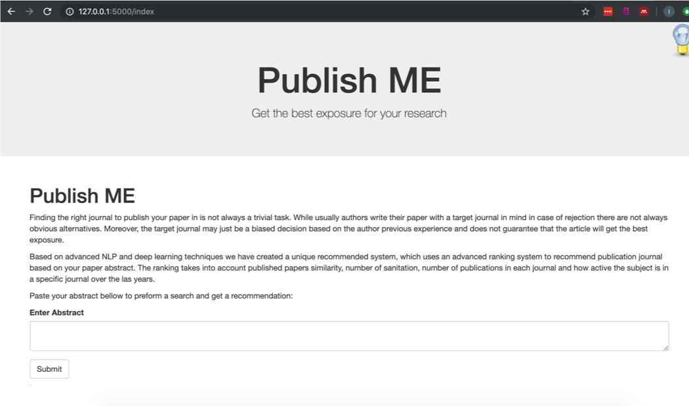

# Capstone project 2 "Pulish ME, journal submission recommander system".

The repository contains all the scripts notebooks and submission files for the project :Capstone project 2 "Pulish ME, journal submission recommander system".

The recommender system  can identify the best jurnal candidates for publication based on paper abstract similarity. The underlying assumption of this system is that journals who publish high volume of articles which are similar to the proposed paper will give the best exposure and acceptance chances.

 
###### Final website

The repository contains the flowing files and directories:
1. '/Src' - A folder containig the training and embedding functions for different mrhods (i.e doc2vec, word2vec tfidf)
2. '/Utility scrpits' - Scripts used for manipularting and cleaning the dataset.  
with the best meta parameters for each one.
3. '/webapp' - website for the project (flask based)
4. 'Milestone Report.ipynb' - A notebook containing the data cleaning and statistical inference steps
5. 'Evaluating_classifiers.ipynb' - A notebook with an example code which shows how different classifiers are evaluated. 
and meta-parameters grid search. The final evaluations was performed on a computer grid using a python scrips
6. 'Cap2.pptx' - Powepoint slide deck.
7. 'early_testing.ipynb' - Notebook containg test results for the doc2vec method which seems to provide the best results.
8. 'early_testing_scoring.ipynb' - A notebok for testing and tuning the scoring method
